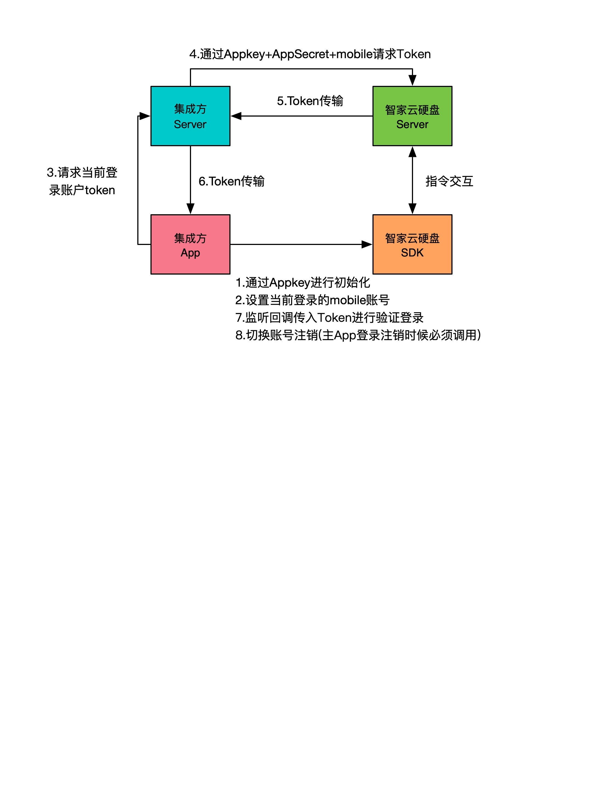

# 智家云硬盘（cloudNas）文档说明
 

本仓库用以说明 智家云硬盘（cloudNas）的产品使用、SDK集成、服务端API及示例项目（Sample code）

## 更新日志
1. [iOS SDK 更新日志](开发文档/SDK集成/iOS/CHANGELOG.md)
2. [Android SDK 更新日志](开发文档/SDK集成/Android/CHANGELOG.md)

## 客户端集成文档
1. [iOS SDK API使用手册](开发文档/SDK集成/iOS/user_guide.md)
2. [Android SDK API使用手册](开发文档/SDK集成/Android/user_guide.md)
3. [Flutter Plugin使用手册]()

## 服务端 APIs
1. [REST APIs](开发文档/REST%20APIs/user_guide.md)

## 错误码
1. [Error Code](开发文档/错误码/error_code.md)

## Sample code
1. [iOS 示例代码](https://github.com/yixindev/cloudnas/tree/main/SampleCode/NASSDKDemo_iOS)
2. [运行Android SampleCode](SampleCode/Android/README.md)

## 调用流程
本SDK了给用户带来良好的体验避免二次登录，同时确保数据获取安全性，采用通过第三方服务器使用Appkey+AppSecret+Mobile获取Token的方式进行快捷登录。
