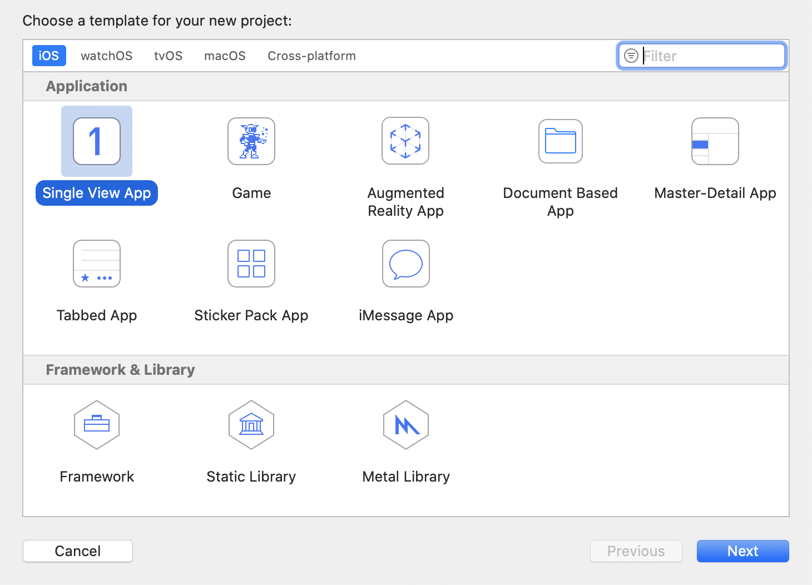

## 概述

智家云硬盘iOS SDK提供了一套简单易用的接口， 允许开发者通过调用NAS SDK(以下简称SDK)提供的API，快速地集成智家云硬盘的界面和功能至现有的iOS应用中。

## 变更记录

| 日期 | 版本 | 变更记录 |
| :------: | :------: | :------ |
| 2021-03-22 | 1.0.2 | 正式发布 |
| 2021-06-24 | 1.0.3 | 1.支持视频转流播放 2.支持小翼管家接入 3.问题修复 |
| 2021-06-25 | 1.0.4 | 优化业务逻辑 | 
| 2021-06-29 | 1.1.0 | 1.去掉多余权限申请 2.缺陷修复 |
| 2021-06-30 | 1.1.1 | 修复音视频播放问题 |
| 2021-07-09 | 1.1.2 | 解决了swift标准库引入问题 |
| 2021-08-26 | 1.1.3 | 1.新增相册自动备份 2.新增smb协议支持 3.新增网络自动切换 4.新增文件缩略图和缓存清理 | 
| 2021-08-31 | 1.1.4 | 去掉FLEX依赖 |
| 2021-10-15 | 1.1.5 | 1.修改验证码限制 2.配合运营推广 3.问题修复 |
| 2021-10-21 | 1.1.7 | 修复激活流程中的问题 |
| 2021-11-30 | 1.2.0 | 新增转存功能 |
| 2022-01-12 | 1.2.1 | 1.增加区域动态配置  2.缺陷修复 |
| 2022-03-07 | 1.2.2 | 修复部分缺陷 |
| 2022-05-05 | 1.2.3 | 1.新增智能相册功能 2.开发框架升级 3.性能优化 |
| 2022-05-12 | 1.2.4 | 1.优化文件选择功能 2.缺陷修复 |
| 2022-08-03 | 1.2.5 | 1.优化大文件下载 2.支持flutter plugin |

## 快速接入

#### 开发环境准备

| 名称 | 要求 |
| :------ | :------ |
| iOS版本 | 10.0以上 |
| CPU架构支持 | ARM64 |
| IDE | XCode |
| 其他 | CocoaPods |

#### 注意事项

- 由于SDK底层使用Flutter跨平台进行开发，目前不支持x86_64架构的AOT包导出，所以SDK无法在模拟器上编译运行。

#### SDK快速接入

1. 新建iOS工程

    a. 运行XCode，选择Create a new Xcode project，选择Single View App，选择Next。
    
    
    
    b. 配置工程相关信息，选择Next。
    
    c. 然后选择合适的工程本地路径，选择Create完成工程创建。

2. 通过CocoaPods集成SDK
	
    进入到工程路径执行pod初始化命令```pod init``` ，生成Podfile文件，注意CocoaPods版本使用1.9.1以上的，防止因为版本过低导致无法拉取sdk。
    
    打开Podfile文件添加如下代码，保存。

    ```
    pod 'NASSDK'
    ```

    执行pod命令，安装SDK

    ```
    pod install
    ```
    
3. 权限配置

	打开项目目录下的xcworkspace工程文件，点击打开```Info.plist```文件，在其中增加相册相关的访问权限配置：
	
	```
	<key>NSPhotoLibraryAddUsageDescription</key>
	<string>需要您的允许才能保存图片到相册</string>
	<key>NSPhotoLibraryUsageDescription</key>
	<string>需要您的允许才能访问相册</string>
	```
	
## 接口开发

### 获取全局实例

#### 接口描述

获取SDK的全局实例对象。

#### 接口定义

```
+(instancetype)sharedInstance;
```

--------------------

### 获取界面容器

#### 接口描述

获取SDK的业务界面，返回值是UIViewController类的实例，将获取的对象添加到相应的位置，例如：TabbarController。

#### 接口定义

```
-(UIViewController*)contentViewController;
```

#### 注意事项

- 容器内部的导航栏样式和跳转由SDK内部定制，不跟随App的全局样式。

--------------------

### 初始化

#### 描述

在调用SDK其他接口之前，首先需要传入应用的**appKey**完成SDK的初始化。

#### 接口定义

```
-(void)initializeWithAppKey:(NSString*)appKey
                 completion:(NASCompletionBlock)completion
```

#### 调用示例

```
[[NASSDK sharedInstance] initializeWithAppKey:appKey
                                   completion:^(NSInteger resultCode, NSString *resultMsg) {
    if (resultCode == NAS_RESULT_SUCCESS) {
        //初始化成功
    }
    else{
        //初始化失败
    }
}];
```

#### 注意事项

- 其他操作必须要等到初始化接口的回调执行之后再进行，否则会失败

--------------------

### 设置授权令牌

#### 接口描述

设置SDK登录授权所必须的token、授权类型以及登录结果回调。

目前小翼管家接入授权类型为**NASAuthTypeXiaoYi**，其他接入方授权类型为**NASAuthTypeUniversal**。

#### 接口定义

```
-(void)setAuthToken:(NSString*)token
               type:(NASAuthType)type
         completion:(NASCompletionBlock)completion;
```

#### 调用示例

```
[[NASSDK sharedInstance] setAuthToken:self.token type:NASAuthTypeXiaoYi completion:^(NSInteger resultCode, NSString *resultMsg) {
   //SDK登录成功
   if (resultCode == NAS_RESULT_SUCCESS) {
   }
   //SDK登录失败
   else{
   }
}];
```

#### 注意事项
- 根据接入方授权流程的不同，授权类型请确保输入正确。

--------------------

### 注销

#### 接口描述

请求SDK注销自己当前的登录账号，变成未登录状态。

#### 接口定义

```
-(void)logoutWithCompletion:(NASCompletionBlock)completion;
```

--------------------

### 监听视频播放请求
#### 接口描述
当SDK点击视频文件进行在线播放时，会调用传入的回调函数，并将处理后的视频地址作为参数传入，应用获取到视频的播放地址时，将传入应用自定义的播放组件进行播放。

#### 接口定义
```-(void)addVideoPlayRequestListener:(NASVideoPlayRequestBlock)listener```

#### 调用示例
```
[[NASSDK sharedInstance] addVideoPlayRequestListener:^(NSString *videoName, NSString *videoURL, NASVideoPlayResponseBlock responseBlock) {
     NASVideoPlayViewController* videoPlayVC = [[NASVideoPlayViewController alloc] initWithVideoUrl:videoURL];
     UINavigationController* navi = [[UINavigationController alloc] initWithRootViewController:videoPlayVC];
     [self.window.rootViewController presentViewController:navi animated:YES completion:nil];
      //播放成功回调
      responseBlock(YES,nil);
}];
```
* 注：SDK采用内部转流的方式对视频数据进行规范化处理，所以应用接收到的将是以`http://localhost`开头的视频播放地址。

--------------------

## 错误码对照表

| 错误码 | 描述 |
| :------: | :------ |
| 200 | 调用成功 |
| 400 | 请求错误 |
| 4001 | 调用中断 |
| 4002 | 数据解析失败 |


