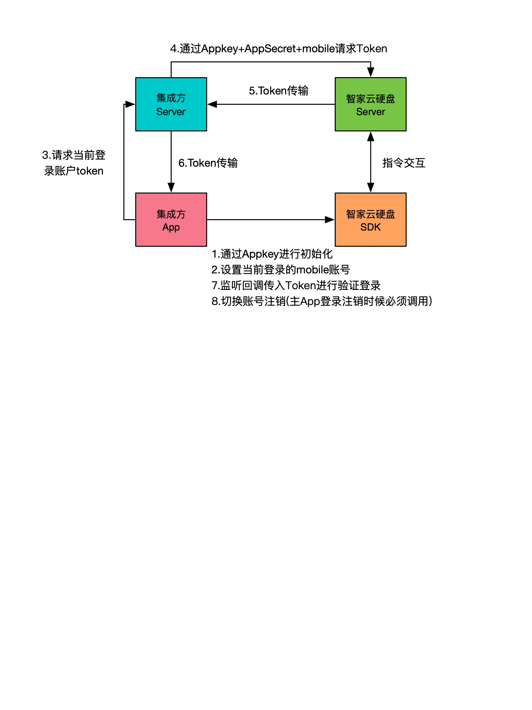

## 概述

智家云硬盘 Rest API 是提供给开发者接入智家云硬盘开放平台的入口。
开发者可以通过智家云硬盘 API 进行二次开发。



## 变更记录

| 日期 | 版本 | 变更内容 |
| :------: | :------: | :------: | 
| 2021-03-11  | 0.0.1 | 初稿 |

## 准备工作

接入智家云硬盘服务前需要联系产品获取 AppKey

## API 网关

网关地址：https://zjdrive.cn/ 

## 签名验证

Rest API对每个访问请求进行身份验证，验证失败的请求无法调用API接口。

签名用的请求头参数

| 参数 | 类型 | 必选(默认值) | 描述 |
| :------ | :------ | :------ | :------ |
| X-NAS-APPID  | String | 是 | 平台分配的应用appid |
| X-NAS-NONCE | String | 是 | 随机字符串（最大长度128个字符）,例如fdsfafewfd |
| X-NAS-TIMESTAMP | String| 是 | 当前 UNIX 时间戳，可记录发起 API 请求的时间。例如1594639036000，单位为毫秒。注意：如果与服务器时间相差超过1分钟，会引起签名过期错误。 |
| X-NAS-CLIENTTYPE  | String | 否(空字符串) | 客户端类型，ios: 51, aos: 50, web: 80, misc: 99999，可以选填 |
| X-NAS-CLIENTVERSION  | String | 否(空字符串) | 客户端版本号，可以选填 |
| X-NAS-DEVICEID  | String | 否(空字符串) | 第三方APP维护的设备ID，可以选填 |
| X-NAS-VERSION  | String | 否(空字符串) | NAS接口版本号，可以选填 |
| X-NAS-CHECKSUM | String | 是 | 签名串，具体算法参考 [签名代码](#sign_code) |

## 签名代码Demo

<span id="sign_code" />

```java

/**
 * 签名算法说明：
 * 按序拼接字符串 appId + timestamp + bodymd5 + nonce + clientType + clientVersion + deviceId + version + appSecret, 进行SHA256哈希计算，转化成16进制字符(String，小写)
 * 注意：
 * * appSecret为平台分配的应用appId对应的秘钥
 * * apache commons-codec参考版本1.13
 */
public class CheckSumBuilder {

    public static final String getCheckSum(String appId, String timestamp, String bodymd5, String nonce, String appSecret) {
        return getCheckSum(appId, timestamp, bodymd5, nonce, "", "", "", "", appSecret);
    }

    /**
     * 所有输入参数建议先调用org.apache.commons.lang3.StringUtils#trimToEmpty，避免前后多余的空格导致校验失败
     */
    public static final String getCheckSum(String appId, String timestamp, String bodymd5, String nonce, String clientType, String clientVersion, String deviceId, String version, String appSecret) {
        String source = appId + timestamp + bodymd5 + nonce + clientType + clientVersion + deviceId + version;
        //签名没通过，请反馈以下输出
        //System.out.println("source fields: " + appId + "," + timestamp + "," + bodymd5 + "," + nonce + "," + clientType + "," + clientVersion + "," + deviceId + "," + version + ".");
        return org.apache.commons.codec.digest.DigestUtils.sha256Hex(source + appSecret);
    }

    /**
     * 请求包体内容和输入参数保持相等，包括任何字符，比如回车
     * <p>
     * 计算并获取md5值(小写)
     */
    public static final String getMD5(String requestBody) {
        //签名没通过，请反馈以下输出
        //System.out.println("request body: " + requestBody + ".");
        return org.apache.commons.codec.digest.DigestUtils.md5Hex(requestBody);
    }

    public static final void main(String[] args) {
        String sampleRequestBody = "{}";
        String bodymd5 = getMD5(sampleRequestBody);
        String checkSum = getCheckSum("demo", System.currentTimeMillis() + "", bodymd5, "dkfafkdjfk", "demosecret");
        System.out.println(checkSum);
    }
}

```


## 公共响应参数
|参数|类型|必须|说明|
|:----|:----|:----|:----|
|data|json|N|响应数据|
|code|int|Y|状态码，200：表示请求处理成功|
|msg|String|N|响应描述|

```json
{
  "data": {},
  "code": 200,
  "msg": "OK"
}
```


## Rest APIs

### 获取SDK Access Token

1. 接口描述  

获取sdk access token，授权后可以调用更多服务api接口

2. 接口请求地址

```
POST https://${domain}/nas/sdk/token HTTP/1.1
Content-Type: application/json;charset=utf-8
```


3. 输入参数

```json
{
  "user_id": 18100000000
}
```

user_id: 手机号

4. 输出参数
* Content-Type: application/json; charset=utf-8
 
* 成功结果示例
```json
{
  "code": 200,
  "msg": "OK",
  "data": { 
    "access_token": "1D45T7ofpx",
    "refresh_token": "723YU6x8qxp",
    "expire": 3600 #seconds
  }
}
```

* 失败结果示例
```json
{
    "code":500,
    "msg":"服务器内部错误"
}
```

## 错误码

| 错误码 | 说明 |
| :------: | :------: |
|400 | 非法的参数 |
|401 | 请求未通过验证 |
|500 | 服务器内部异常 |
|900 | 未知错误 |


