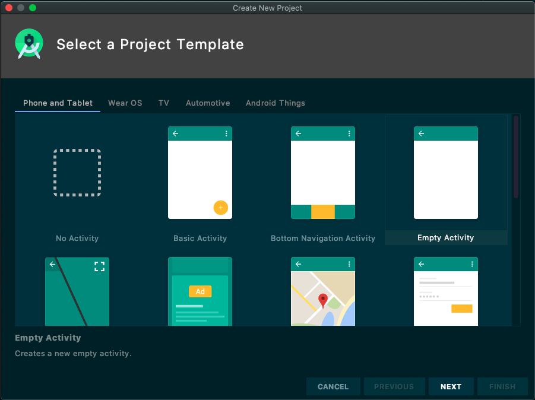

## 概述

智家云硬盘iOS SDK提供了一套简单易用的接口，允许开发者通过调用cloudNas SDK(以下简称SDK)提供的API，快速地集成存储功能至现有iOS应用中。

## 变更记录

| 日期 | 版本 | 变更内容 |
| :------: | :------: | :------- |
| 2021-03-11  | 1.0.0 | 首次正式发布 |

## 快速接入

#### 开发环境准备

| 名称 | 要求 |
| :------ | :------ |
| JDK版本  | >1.8.0 |
| 最小Android API 版本 | API 19 |
| CPU架构支持 | ARM64、ARMV7 |
| IDE | Android Studio |
| 其他 | 依赖androidx，不支持support库 |

#### SDK快速接入

1. 新建Android工程

    a. 运行Android Sudio，顶部菜单依次选择“File -> New -> New Project...”新建工程，选择'Phone and Tablet' -> 'Empty Activity' 单击Next。

    
    
    b. 配置工程相关信息，请注意Minimum API Level为API 19。
    
    
    c. 单击'Finish'完成工程创建。

2. 添加SDK编译依赖

    修改工程目录下的'app/build.gradle'文件，添加SDK的依赖。
    ```groovy
    dependencies {
      //声明SDK依赖，版本可根据实际需要修改
    }
    ```
    之后通过顶部菜单'Build -> Make Project'构建工程，触发依赖下载，完成后即可在代码中引入SDK中的类和方法。

3. 权限处理

    SDK正常工作需要应用获取以下权限
    ```xml
    <!-- 网络相关 -->

    <!-- 读写外部存储 -->

    <!-- 多媒体 -->
    ```
    以上权限已经在SDK内部进行声明，开发者可以不用在```AndroidManifest.xml```文件中重新声明这些权限，但运行时的权限申请需要应用开发者自己编码实现，可在应用首页中统一申请，详情可参考[Android运行时权限申请示例](https://developer.android.google.cn/guide/topics/permissions/overview)。如果运行时对应权限缺失，SDK可能无法正常工作，如会议时无图像、对方听不到己方声音等。

4. SDK初始化

    在使用SDK其他功能之前首先需要完成SDK初始化，初始化操作需要保证在**Application**的**onCreate**方法中执行。代码示例如下：
    ```java
    ```

5. 调用相关接口完成特定功能，详情请参考API文档。

- [登录鉴权](#登录鉴权)
    ```java
    //Token登录

    ```
- [注销登录](#注销)
    ```java
    NEMeetingSDK.getInstance().logout(NECallback<Void> callback);
    ```

## 业务开发

### 初始化

#### 描述

在使用SDK其他接口之前，首先需要完成初始化操作。

#### 业务流程

1. 配置初始化相关参数

```java
```

2. 调用接口并进行回调处理，该接口无额外回调结果数据

```java
```

#### 注意事项

- 初始化操作需要保证在**Application**类的**onCreate**方法中执行

--------------------

### 登录鉴权

#### 描述

请求SDK进行登录鉴权，只有完成SDK登录鉴权才允许进行后续操作。说明如下：


下面就`Token登录`方式说明SDK登录逻辑，其他登录方式同理。

#### 业务流程

1. 获取登录用账号ID和Token。Token由网易会议应用服务器下发，但SDK不提供对应接口获取该信息，需要开发者自己实现。

```java
String accountId = "accountId";
String accountToken = "accountToken";
```

2. 登录并进行回调处理，该接口无额外回调结果数据

```java
```

#### 注意事项


--------------------

### 创建会议

#### 描述

在已经完成SDK登录鉴权的状态下，创建并开始登录。

#### 业务流程

