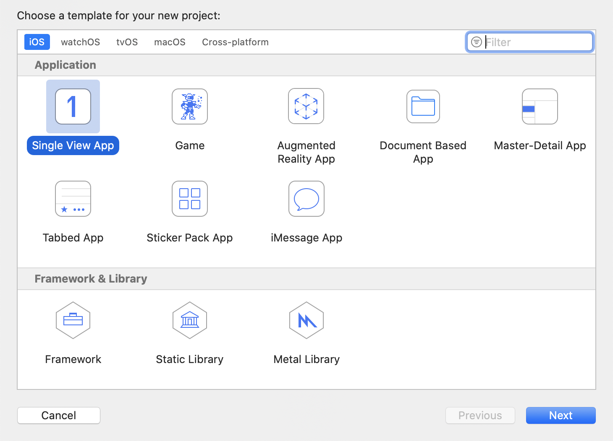

## 概述

智家云硬盘iOS SDK提供了一套简单易用的接口， 允许开发者通过调用NAS SDK(以下简称SDK)提供的API，快速地集成智家云硬盘的界面和功能至现有的iOS应用中。

## 变更记录

| 日期 | 版本 | 变更记录 |
| :------: | :------: | :------ |
| 2021-03-15 | 1.0.0 | 首次发布 |

## 快速接入

#### 开发环境准备

| 名称 | 要求 |
| :------ | :------ |
| iOS版本 | 10.0以上 |
| CPU架构支持 | ARM64 ARMV7|
| IDE | XCode |
| 其他 | CocoaPods |

#### 注意事项

- 由于SDK底层使用Flutter跨平台进行开发，所以SDK不支持模拟器编译运行。

#### SDK快速接入

1. 新建iOS工程

    a. 运行XCode，选择Create a new Xcode project，选择Single View App，选择Next。
    
    
    
    b. 配置工程相关信息，选择Next。
    
    c. 然后选择合适的工程本地路径，选择Create完成工程创建。

2. 通过CocoaPods集成SDK
	
    进入到工程路径执行pod初始化命令```pod init``` ，生成Podfile文件，注意CocoaPods版本使用1.9.1以上的，防止因为版本过低导致无法拉取sdk。
    
    打开Podfile文件添加如下代码，保存。

    ```
    pod 'NASSDK'
    ```

    执行pod命令，安装SDK

    ```
    pod install
    ```
    
3. 权限配置

	打开项目目录下的xcworkspace工程文件，点击打开```Info.plist```文件，在其中增加相册相关的访问权限配置：
	
	```
	<key>NSPhotoLibraryAddUsageDescription</key>
	<string>需要您的允许才能保存图片到相册</string>
	<key>NSPhotoLibraryUsageDescription</key>
	<string>需要您的允许才能访问相册</string>
	```
	
## 接口开发

### 获取全局实例

#### 接口描述

获取SDK的全局实例对象。

#### 接口定义

```
+(instancetype)sharedInstance;
```

--------------------

### 获取界面容器

#### 接口描述

获取SDK的业务界面，返回值是UIViewController类的实例，将获取的对象添加到相应的位置，例如：TabbarController。

#### 接口定义

```
-(UIViewController*)contentViewController;
```

#### 注意事项

- 容器内部的导航栏样式和跳转由SDK内部定制，不跟随App的全局样式。

--------------------

### 初始化

#### 描述

在调用SDK其他接口之前，首先需要传入应用的**appKey**完成SDK的初始化。

#### 接口定义

```
-(void)initializeWithAppKey:(NSString*)appKey
                 completion:(NASCompletionBlock)completion
```

#### 调用示例

```
[[NASSDK sharedInstance] initializeWithAppKey:appKey
                                   completion:^(NSInteger resultCode, NSString *resultMsg) {
    if (resultCode == NAS_RESULT_SUCCESS) {
        //初始化成功
    }
    else{
        //初始化失败
    }
}];
```

#### 注意事项

- 其他操作要等到初始化接口的回调执行之后再进行，否则会失败

--------------------

### 登录鉴权

#### 接口描述

请求SDK进行登录鉴权，只有SDK获取登录鉴权信息完成登录后，用户才可以正常使用智家云硬盘的相关功能。

#### 接口定义

```
-(void)authWithMobile:(NSString*)mobile
                token:(NSString*)token
            completion:(NASCompletionBlock)completion;
```

#### 调用示例

1. 获取登录用户手机号和token，token由应用服务器下发。

```objective-c
NSString *mobile = @"mobile";
NSString *token = @"token";
```

2. 传入获取的参数后SDK进行登录授权并回调登录结果。

```
[[NASSDK sharedInstance] authWithMobile:mobile
                                  token:token
                             completion:^(NSInteger resultCode, NSString *resultMsg) {
    if (resultCode == NAS_RESULT_SUCCESS) {
        //登录成功
    }
    else{
        //登录失败
    }
}];
```

#### 注意事项
- 应用切换账号或者登出时必须调用SDK的注销接口。

--------------------

### 注销

#### 接口描述

请求SDK注销自己当前的登录账号，变成未登录状态。

#### 接口定义

```
-(void)logoutWithCompletion:(NASCompletionBlock)completion;
```

--------------------

### 监听token过期

#### 接口描述

添加SDK token过期的监听回调，获取新的token后回传给SDK。

#### 接口定义

```
-(void)addTokenExpiredListener:(NASTokenListenBlock)listenser;
```

#### 调用示例

```
[[NASSDK sharedInstance] addTokenExpiredListener:^(NASTokenSendBlock sendBlock) {
    //应用获取新的token
    [app fetchToken:^(NSString *token) {
        //回传给SDK
        sendBlock(token);
    }];
}];
```

## 错误码对照表

| 错误码 | 描述 |
| :------: | :------ |
| 200 | 调用成功 |
| 400 | 请求错误 |
| 4001 | 调用中断 |
| 4002 | 数据解析失败 |


